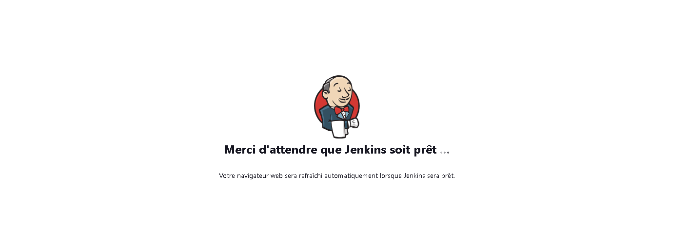
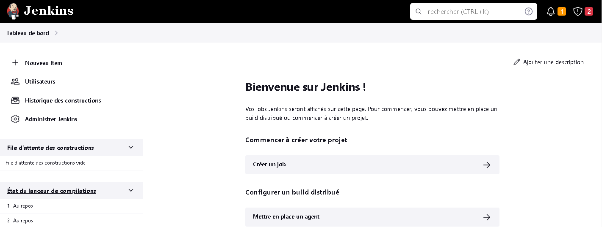
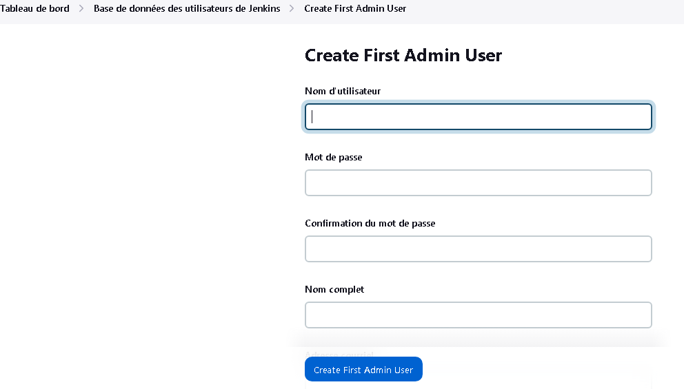
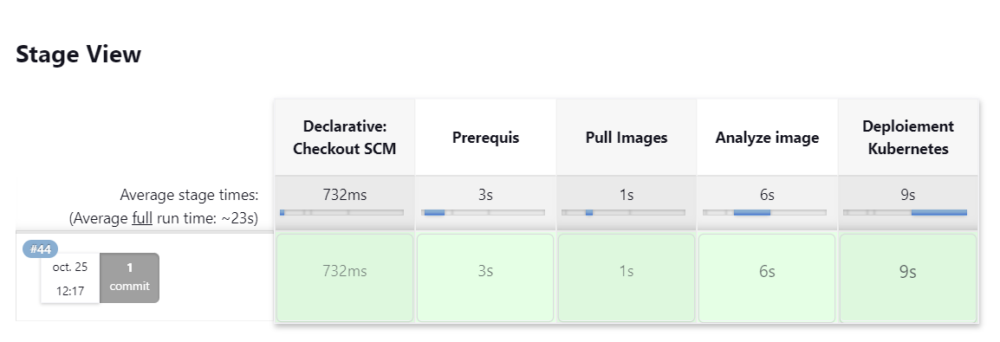
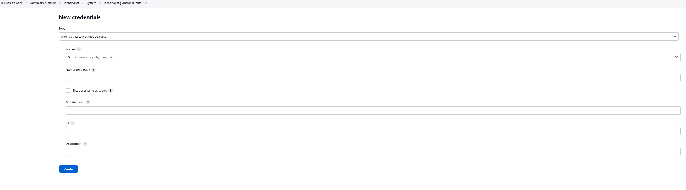
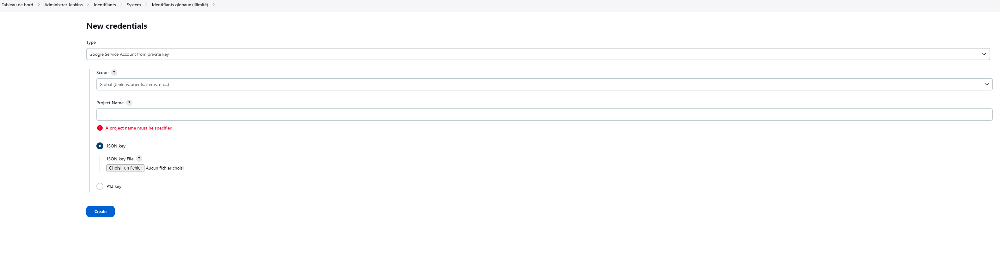

# TP 4 - Mise en place pour une application Python d’une chaîne CD

### Objectif

Le TP consiste à mettre en oeuvre une chaîne de déploiement continue pour les applications python.

### Prérequis

 - un compte Github
 - un compte docker hub
 - Lance le script sur linux et avoir docker installer dessus

 ### Composition du dépot

Le dossier est constitué des dossiers et fichiers comme suit:

```
├── ansible
├── jenkins
│       ├── plugins.txt
├── terraform
├── docker-compose.yml
├── Jenkinsfile
├── README.md
```
### Configuration du repo et de jnekins

#### Configuration du repo
1. Cloner le repo

     `git clone https://github.com/Herve-NAHIMANA/TP4-CD.git`

2. Se place dans le dossier `TP4-CD`
3. Change la branche en fonction de l'environnement `Dev`,`Test`,`Prod`
4. Dans le terminal, effacer l'ancien remote origin

     `git remote rm origin`

5. Créer le nouveau remote origin correpondant au repo créé à l'étape 3

     `git remote add origin git@[url_depot_git]`

6. Ajouter au repo et créer un commit

      `git add .`
      `git commit -m "<Texte au choix>"`

7. Push l'image sur le nouveau repo

    `git push origin <nom de la branche>`

#### Configuration de jenkins

1. Dans le terminal, se positionner dans le dossier clone, et executer la commande docker compose

    `docker compose up -d`

2. ouvrir le navigateur et se connecter à `localhost:8080` ou `votre-ip:8080`

3. Quand Jenkins n'est pas encore prêt mais qu'il est correctement créé, on aura un écran vous invitant à patienter



4. Une fois prêt, vous aurez l'écran de jenkins sans aucun compte créé, il faut créer un compte pour sécuriser jenkins.



5. Pour configurer jenkins, il faut aller dans `Administrer Jenkins` > `Security`


6. Il faut choisir royaume pour la sécurité et les autorisations.


>[!WARNING]
>Il faut décocher la case `Autoriser les utilisateurs à s'inscrire`

7. Une fois enregistré la configuration, vous aurez la page de création du premier compte utilisateur



8. Pour le webhook, j'ai utilisé webhookrelay. Pour le télécharger, [Cliquer ici](https://docs.webhookrelay.com/installation-options/installation-options/install-cli)

### Présentation du pipeline

Les étapes du pipeline sont décritées dans le Jenkinsfile qui est disponible sur le dépôt, jenkins l'utilise pour executer les tâches suivantes:

1. Installe les paquets nécéssaire
2. Pull l'image docker avec la commande `docker pull {image_docker}`
3. Installation de gcloud-cli
4. Analyse de l'image docker avec `docker-scout`
4. Deploiement de l'application sur GKE


>[!WARNING]
Il faut se connecter manuellement dans le container jenkins et lance la commande `gcloud auth application-default login ` pour donner à jenkins l'accès sur google cloud.

>[!WARNING]
Pour que le plugin googlekubernetesEngine et docker-scout fonctionnent, il faut parametre les variables d'environnements(DOCKER_ACCOUNT,CLUSTER_NAME,LOCATION,CREDENTIALS_ID,PROJECT_ID) dans le fichier Jenkinsfile.

- DOCKER_ACCOUNT: correspond aux identifiants utilise pour se connecter sur docker hub

- CLUSTER_NAME: Le nom du cluster kubernetes

- LOCATION: La zone ou la region où se trouve le cluster kubernetes

- CREDENTIALS_ID: Le fichier json contenant la clé du compte service qui a au minimum le droit `Container.services.develop` pour pouvoir deployer l'application dans le cluster`

- PROJECT_ID: L'id du projet GCP

Les identifiants (DOCKER_ACCOUNT et CREDENTIALS_ID) étant secrets, il ne faut pas les rendre publique donc il faut les renseigner comme suit:

*DOCKER_ACCOUNT:*

- `Administrateur jenkins > Credentials > System > Identifiants globaux (illimité) > Add Credientials`

- Dans type, sélectionner Nom d'utilisateur et mot de passe



*CREDENTIALS_ID:*

- `Administrateur jenkins > Credentials > System > Identifiants globaux (illimité) > Add Credientials`

- Dans type, sélectionner Google Service Account from private key

- Renseigner le nom du project gcp

- Télécharge le fichier json contenant la clé.



Le rapport est accessible en selectionnant le numéro d'un build, clique sur workspace, suivre le lien `/var/jenkins_home/workspace/jenkins-integration-prod`et ouvrir le fichier `report.json` . 
