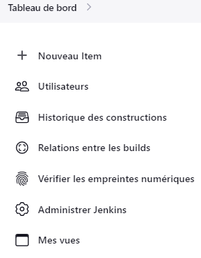
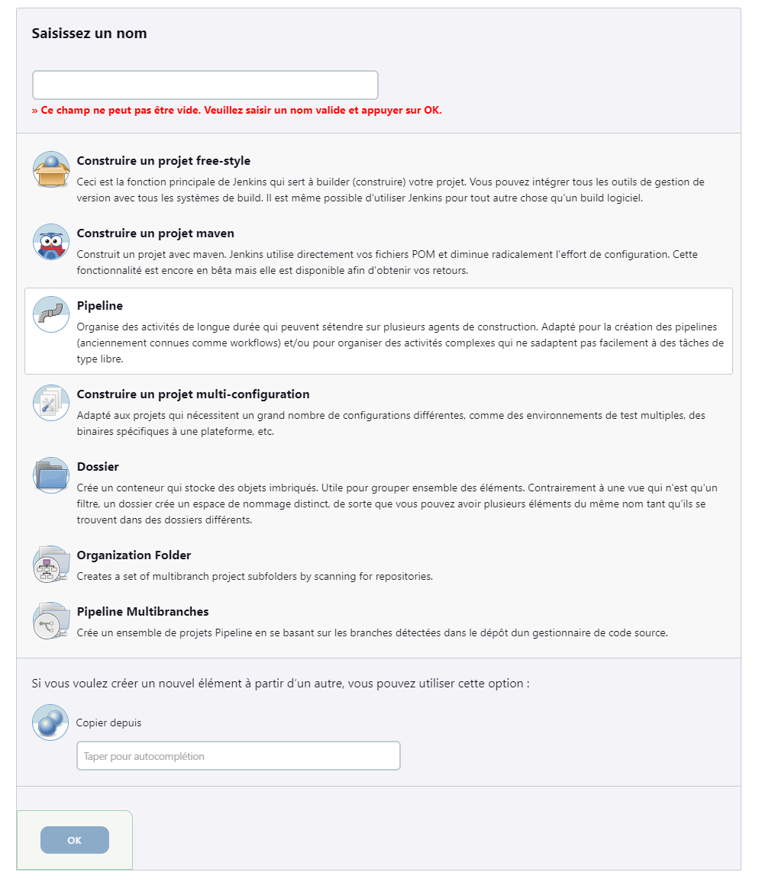
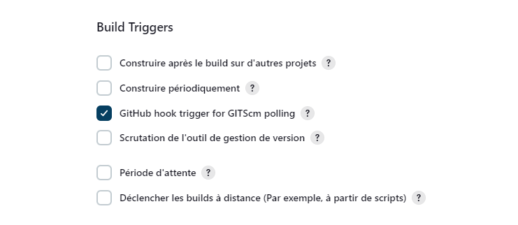
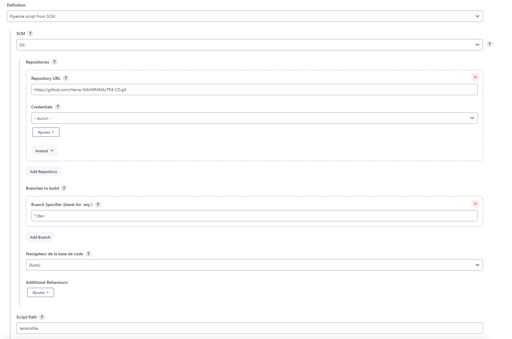
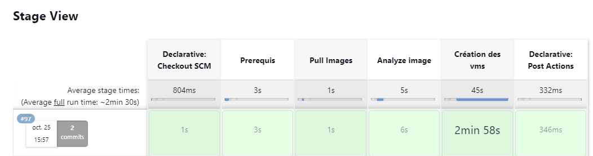

# TP 4 - Mise en place pour une application Python d’une chaîne CD

### Objectif

Le TP consiste à mettre en oeuvre une chaîne de déploiement continue pour les applications python dans un environnement dev avec docker.

### Prérequis

 - un compte Github
 - un compte docker hub
 - Lance le script sur linux et avoir docker installer dessus
 - Compte de service
 - Cluster kubernetes gcp

Si vous envisagez deploy l'application en déhors de GCP, il faut adapter le code au provider utilisé.
 ### Composition du dépot

Le dossier est constitué des dossiers et fichiers comme suit:

```
├── ansible
├── jenkins
│       ├── plugins.txt
├── terraform
├── docker-compose.yml
├── Jenkinsfile
├── README.md
```
### Configuration du repo et de jenkins

#### Configuration du repo
1. Cloner le repo

     `git clone https://github.com/Herve-NAHIMANA/TP4-CD.git`

2. Se place dans le dossier `TP4-CD`
3. Change la branche en fonction de l'environnement `Dev`,`Test`,`Prod`
4. Dans le terminal, effacer l'ancien remote origin

     `git remote rm origin`

5. Créer le nouveau remote origin correpondant au repo créé à l'étape 3

     `git remote add origin git@[url_depot_git]`

6. Ajouter au repo et créer un commit

      `git add .`
      `git commit -m "<Texte au choix>"`

7. Push l'image sur le nouveau repo

    `git push origin <nom de la branche>`

#### Configuration de jenkins

1. Dans le terminal, se positionner dans le dossier clone, et executer la commande docker compose

    `docker compose up -d`

2. ouvrir le navigateur et se connecter à `localhost:8080` ou `votre-ip:8080`

3. Quand Jenkins n'est pas encore prêt mais qu'il est correctement créé, on aura un écran vous invitant à patienter


4. Une fois prêt, vous aurez l'écran de jenkins sans aucun compte créé, il faut créer un compte pour sécuriser jenkins.


5. Pour configurer jenkins, il faut aller dans `Administrer Jenkins` > `Security`


6. Il faut choisir royaume pour la sécurité et les autorisations.


>[!WARNING]
>Il faut décocher la case `Autoriser les utilisateurs à s'inscrire`

7. Une fois enregistré la configuration, vous aurez la page de création du premier compte utilisateur


8. Pour le webhook, j'ai utilisé webhookrelay. Pour le télécharger, [Cliquer ici](https://docs.webhookrelay.com/installation-options/installation-options/install-cli)

9. il faut créer un pipeline, en cliquant sur Nouveau Item/New Item



10. Saisissez le nom du job, et séléctionnez pipeline, puis cliquez sur ok



11. Coche la case Github hook trigger for GITScm polling afin d'autoriser le déclenchement du job par les webhooks.



12. Dans pipeline definition, séléctionnez `Pipeline script from SCM`
13. Dans SCM, séléctionnez `git`
14. Dans Repositories, renseigner `l'URL du repo git`
15. Dans branches to build, remplacez `master` par `dev`
16. Laisser le champ Script Path par défaut.



### Présentation du pipeline

Les étapes du pipeline sont décritées dans le Jenkinsfile qui est disponible sur le dépôt, jenkins l'utilise pour executer les tâches suivantes:

1. Installe les paquets nécéssaire
2. Pull l'image docker avec la commande `docker pull {image_docker}`
3. Installation de gcloud-cli
4. Analyse de l'image docker avec `docker-scout`
4. Deploiement de l'application sur une VM dans GCP avec docker run



>[!WARNING]
Il faut se connecter manuellement dans le container jenkins et lance la commande `gcloud auth application-default login ` pour donner à jenkins l'accès sur google cloud.

L' identifiant (DOCKER_ACCOUNT) étant secrets, il ne faut pas le rendre publique donc il faut le renseigner comme suit:

*DOCKER_ACCOUNT: correspond aux identifiants utilise pour se connecter sur docker hub*

- `Administrateur jenkins > Credentials > System > Identifiants globaux (illimité) > Add Credientials`

- Dans type, sélectionner Nom d'utilisateur et mot de passe


Le rapport est accessible en selectionnant le numéro du build, clique sur workspace, suivre le lien `/var/jenkins_home/workspace/jenkins-integration`et ouvrir le fichier `report.json` . 
